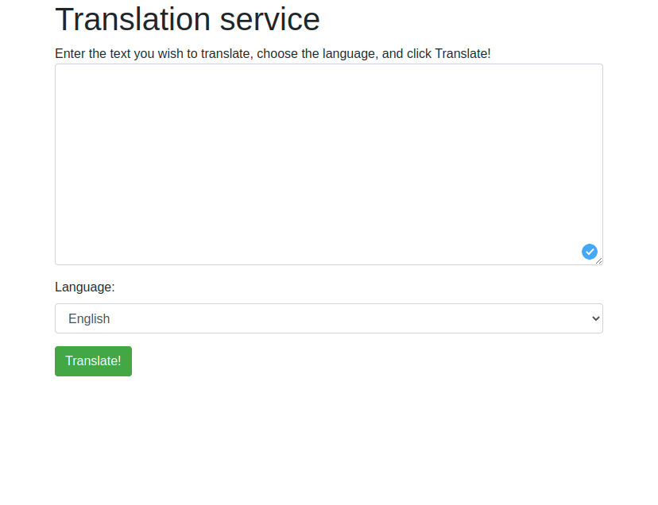

# Usando a api do MicroSoft Azure de tradução - Python

Projeto criado com flask como os ensinamento de Microsoft Learn
Treinamento usado para aprender a usar o Azure translator AI

Na opção de linguagem tem disponivel as seguintes tradução
- English
- Italian
- Japonese
- Russian
- German
